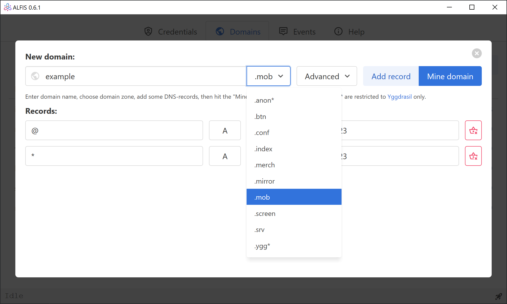

#  Alfis


Alternative Free Identity System

This project represents a minimal blockchain without cryptocurrency, capable of sustaining any number of domain names in a bunch of original alternative zones.




## How it works?
Every node connects to its siblings and synchronizes the domain database.
This DB consists of cryptographically bound blocks, that contain encrypted domain names, contacts, and some info, if you wish.
There are 10 domain zones available to get domain in:
`.anon`, `.btn`, `.conf`, `.index`, `.merch`, `.mirror`, `.mob`, `.screen`, `.srv`, `.ygg`.
But, `.anon` and `.ygg` are bound to have IP-addresses from Yggdrasil Network only.

## Building and running

### On every OS
You can download and run already built binaries from [releases](https://github.com/Revertron/Alfis/releases), or you can build project yourself.

You can build Alfis by issuing `cargo build` and `cargo run` commands in a directory of cloned repository.
If you want to build release version you need to do `cargo build --release` as usual.

###  On Windows
You don't need any additional steps to build Alfis, just stick to the MSVC version of Rust.

If you see an error about missing `VCRUNTIME140.dll` when running alfis you will need to install [VC Redistributable](https://www.microsoft.com/en-us/download/details.aspx?id=52685) from Microsoft.

If you want to use modern browser engine from Edge instead of old from IE, you need to build with this command: `cargo build --release --features "edge"` (or use corresponding build from [releases](https://github.com/Revertron/Alfis/releases)).

###  On Windows (MINGW64)
If you'd rather use Gnu version of Rust you can build Alfis by these steps:
```
pacman -S git mingw64/mingw-w64-x86_64-rust mingw64/mingw-w64-x86_64-cargo-c
git clone https://github.com/Revertron/Alfis.git
cd Alfis
cargo build
```

###  On Linux
If you are building on Linux you must ensure that you have `libwebkitgtk` library installed.
You can do it by issuing this command: `sudo apt install libwebkit2gtk-4.0-dev` (on Debian/Ubuntu and derivatives).

####  On Arch Linux

Install from available [AUR package](https://aur.archlinux.org/packages/alfis) created by [@pztrn](https://github.com/pztrn):

```sh
yay -S alfis
```

## Installation

### Debian/Ubuntu (only blockchain DNS, without GUI)
If you want to just use ALFIS as a DNS daemon and resolve domains in blockchain, as well as clearnet domains.
You just need to install `alfis` service from repo and change your resolver in `/etc/resolv.conf`.
Beware of NetworkManager, it can change your resolvers at will.

1. Download repository public key and add it to your APT
```
wget -O - https://deb.revertron.com/key.txt | sudo apt-key add -
```
2. Add repository path to sources list
```
echo 'deb http://deb.revertron.com/ debian alfis' | sudo tee /etc/apt/sources.list.d/alfis.list
```
3. Update packages and install ALFIS
```
sudo apt update && sudo apt install alfis
```
4. Enable and start the service
```
systemctl enable --now alfis
```
After that configuration is in file `/etc/alfis.conf` and data is saved to `/var/lib/alfis`.
If you have some DNS server bound to port 53, it will not properly start. Deal with it on your own.

### GUI version Windows/Linux/macOS (if you want to create and change domains)
If you want to create and manage your own domains on blockchain, you will need a version with GUI.
You can download it from [releases](https://github.com/Revertron/Alfis/releases) section, choose appropriate OS and architecture version.
It needs to be without `nogui` suffix.

Just unzip that archive in some directory and run `alfis` (or `alfis.exe`) binary.
By default, it searches for config file, named `alfis.toml` in current working directory, and creates/changes `blockchain.db` file in the same directory.
If you want it to load config from another file you can command it so: `alfis -c /etc/alfis.conf`.

## Roadmap
1. Stabilize blockchain functions (domain transfer, info & contacts in UI), bug hunting and fixing.
2. Change DNS server/proxy to own resource saving implementation (using trust-dns-proto for RR parsing).
3. P2P traffic encryption (ECDH).
4. Web-GUI to manage you node from browser.